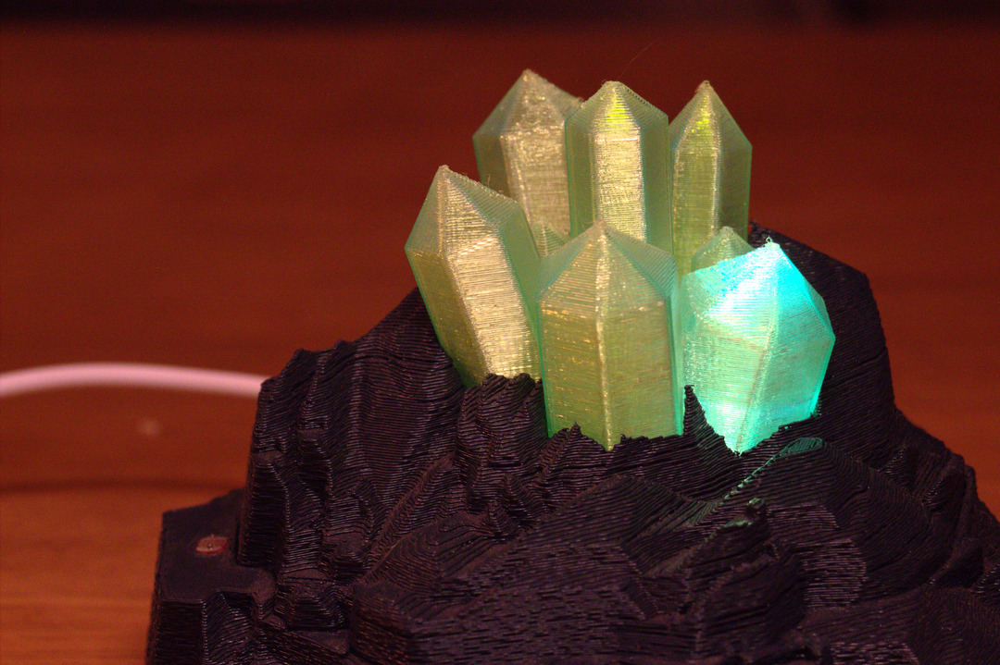
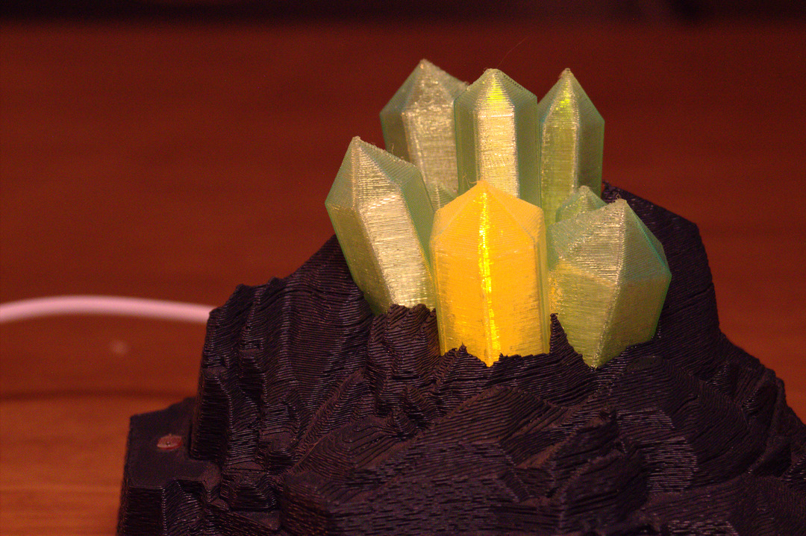
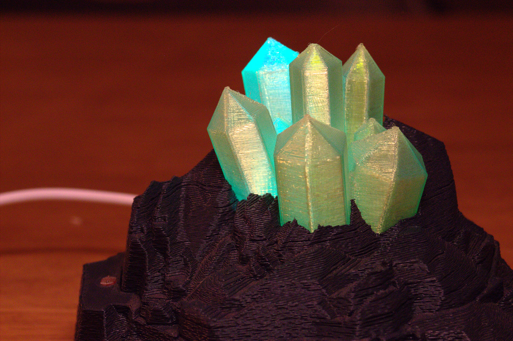
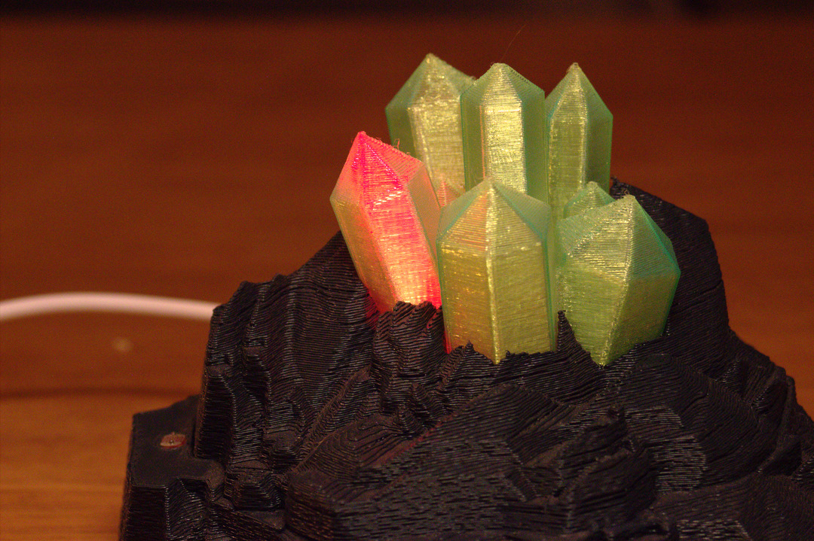
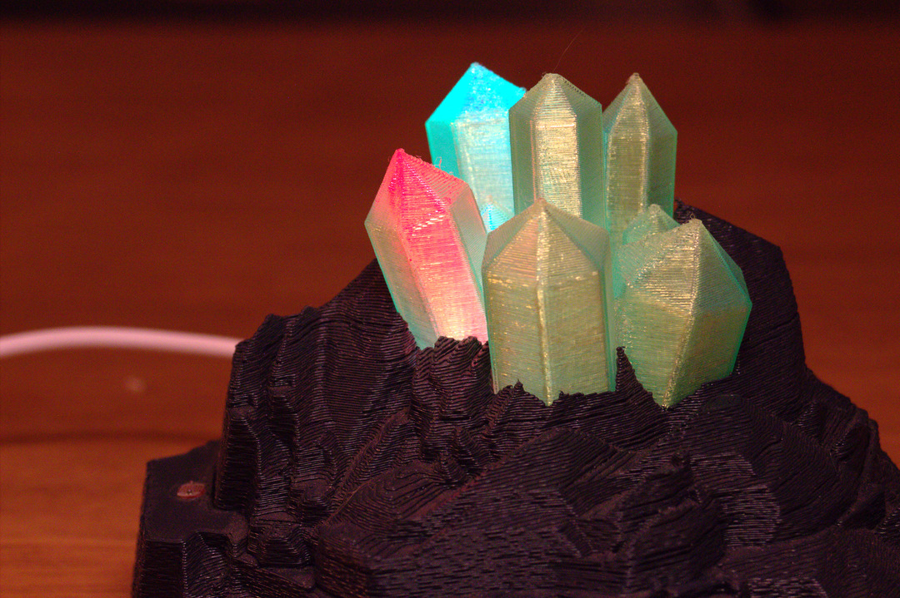
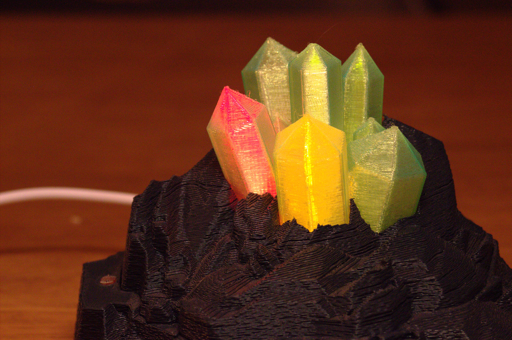

# octoprint-status-crystal
### A 3D-printed status lamp for your octoprint-enabled printer

This lamp shows your printer's status and connects via the Octoprint API. It has a LDR for automatic brightness sensing.

The STL files are adapted from [this Printables link.](https://www.printables.com/model/412168-subtle-color-changing-crystals)

## Printing

The STLs were printed on a Prusa i3. The two rock bases were printed in Prusament Gentleman's Gray PLA, and the crystals in translucent Prusament Neon Green PETG.

Layer height was 0.2 mm. Models were printed with the Fuzzy Skin effect on the sides to make them look more natural.

## Assembly

My lamp runs on a Raspberry Pi Pico W (you could use another microcontroller, as long as it has WiFi). It is powered over USB through the cutout in the base (I did have to shave down the micro USB cable). There are 6 differently colored LEDs attached to the Pico.

The cutout in the side of the crystal is for a LDR. It is hooked up as a voltage divider with a 10k resistor.

The LEDs press fit into the bottom of the crystal. Two of the openings are not used.

## Programming

Place code.py in the root of your CircuitPython device.
Copy the /lib folder to the /lib folder of your device.

Rename example_settings.toml to settings.toml and update the WiFi info and Octoprint API key for your printer.

There are various settings that can be tweaked in code.py under `USER INPUT AND SETUP`.

Depending on your LEDs, room brightness, etc. you may need to tweak the `BRIGHTNESS_THRESHOLD` for the light/dark changeover.

If your printer is not at `http://octoprint.local` you will need to change `OCTOPRINT_URL`.

## Modes

The lamp has 8 different modes: Idle, Printing, Finished, Heating, Cooling, Error, Paused and Connection Error. In most of the modes, the LEDs have a subtle pulsing animation.

The error sensing is done by reading the Octoprint status, but that is not always reliable. For example, a MMU filament error doesn't change the reported status, the print time just doesn't update. So, the lamp watches the remaining print time, and if it stops updating, the status is set to Error.

When the print finishes, the LEDs pulse fast for 5 minutes (can be changed in code.py) to indicate that the print is done!

### Idle

### Finished

### Printing

### Heating

### Cooling

### Error

### Connection Error

### Paused

## Automatic Brightness Adjustment

