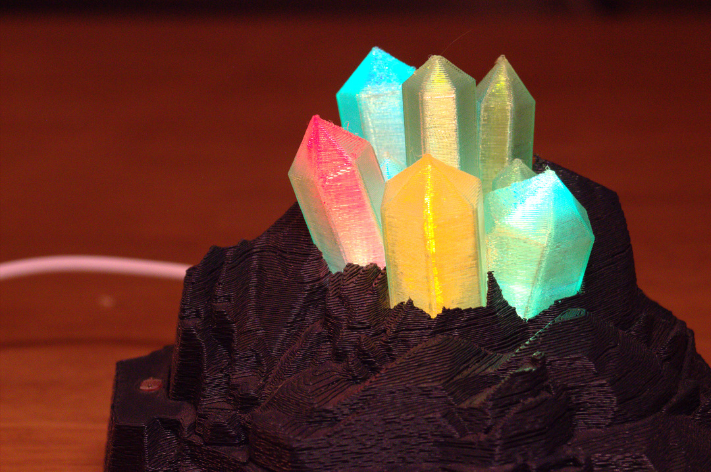
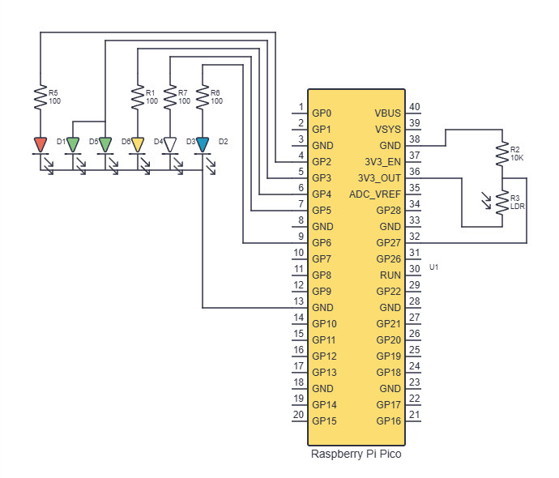
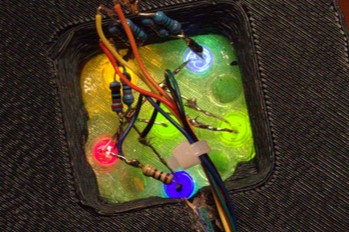

# octoprint-status-crystal
### A 3D-printed status lamp for your octoprint-enabled printer

This lamp shows your printer's status and connects via the Octoprint API. It has a LDR for automatic brightness sensing.

The STL files are adapted from [this Printables link.](https://www.printables.com/model/412168-subtle-color-changing-crystals)

## Printing

The STLs were printed on a Prusa i3. The two rock bases were printed in Prusament Gentleman's Gray PLA, and the crystals in translucent Prusament Neon Green PETG.

Layer height was 0.2 mm. Models were printed with the Fuzzy Skin effect on the sides to make them look more natural.

## Assembly

My lamp runs on a Raspberry Pi Pico W (you could use another microcontroller, as long as it has WiFi). There are 6 differently colored LEDs attached to the Pico.

The cutout in the side of the crystal is for a LDR. It is hooked up as a voltage divider with a 10k resistor.

The LEDs press fit into the bottom of the crystal. Two of the openings are not used.

## Coding

Place code.py and in the root of your CircuitPython device.
Copy the /lib folder to the /lib folder of your device.

Rename example_settings.toml to settings.toml and update the WiFi info and Octoprint API key for your printer.
